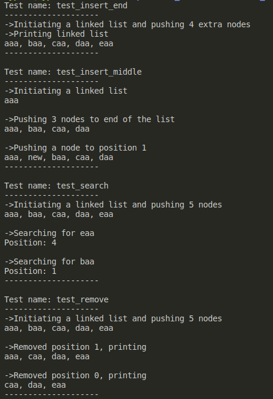

# Linked list
## Implements
- Add a node to any position
- Remove node from any position
- Search for node (returns position)
- Print all nodes
- Free the linked list

## Instructions
Instructions

    gcc *.c -o a.out
    ./a.out

## Console output

