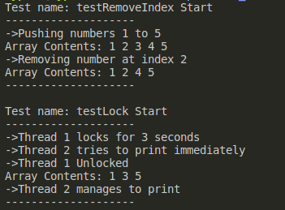

# Thread safe dynamic array
## Implements
- push
- pop
- getIndex
- removeAt

## Known flaws
- Exits program if index is out of bounds (Insufficient Error Handling)
- Moves the data around when programmer removes an element in the middle (Worse Performance, Better Memory)

## Instructions
Instructions

    gcc *.c -o a.out
    ./a.out

## Console output

